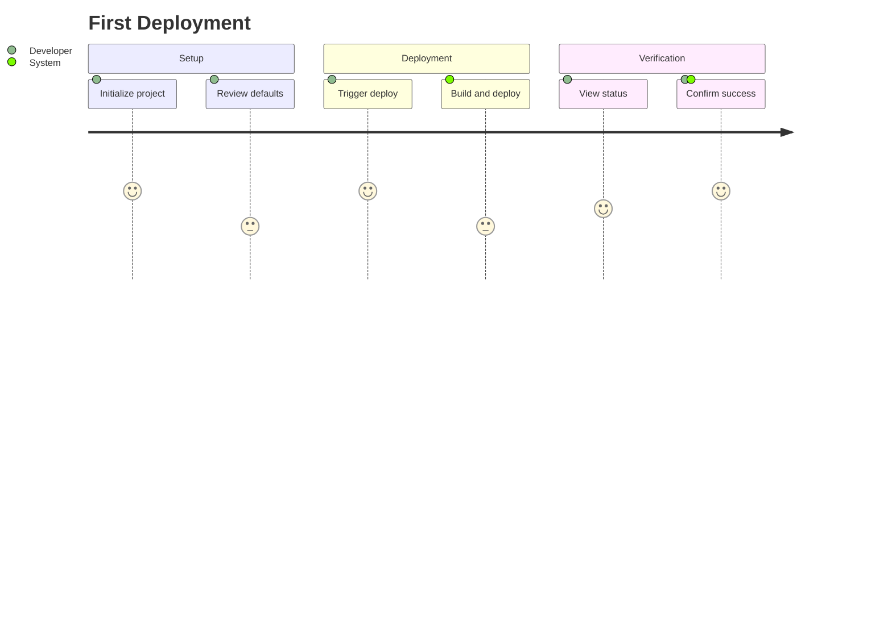

# Journey Mapping Skill

Map user journeys from features to testable Gherkin scenarios, producing planning/journeys/<slug>.md files ready for implementation.

## When to Activate

Use this skill when:
- Mapping a user journey for a feature
- Writing Gherkin scenarios for acceptance criteria
- Working with planning/journeys/
- Translating features to implementable specifications
- Defining "what" the system should do (not "how")

## Methodology

**Chosen:** User Story Mapping + Gherkin BDD

**Rationale:** Research compared User Story Mapping, Customer Journey Maps, Service Blueprints, and Gherkin/BDD. For developer workflows:

- Story Mapping provides the big picture and prevents "bag of mulch" backlogs
- Gherkin provides executable specifications with clear acceptance criteria
- Together they form a complete requirements-to-implementation pipeline

Customer Journey Maps and Service Blueprints are excellent for team alignment but lack direct handoff to implementation. Story Mapping + Gherkin has the clearest path from requirements to code.

### Alternatives Considered

| Methodology | Reason Not Selected | When Appropriate |
|-------------|---------------------|------------------|
| Customer Journey Maps | Focus on emotions/touchpoints, no implementation artifacts | Understanding pain points, cross-team alignment, UX research |
| Service Blueprints | Shows internal processes, too detailed for solo developers | Complex multi-department services, omnichannel experiences |

## Core Principles

### 1. The 1922 Test

Describe requirements as if explaining to someone in 1922.

*If you need technology to describe the need, you're describing implementation.*

**Test:** Could someone with no computers understand this requirement?

### 2. What Not How

Requirements describe outcomes and behaviors, not mechanisms.

*Implementation changes; requirements should survive technology shifts.*

**Test:** Could this be implemented in 3+ different ways?

### 3. Declarative Over Imperative

Gherkin describes intent, not step-by-step UI mechanics.

*Declarative scenarios survive UI changes; imperative scenarios break.*

**Test:** Would this scenario need to change if the UI changed?

### 4. One Scenario One Behavior

Each Gherkin scenario tests exactly one behavior.

*Multiple behaviors per scenario make failures ambiguous.*

**Test:** Is there exactly one When-Then pair in this scenario?

### 5. Domain Language

Use business terminology, not UI element names.

*Scenarios are documentation for stakeholders, not just tests.*

**Test:** Would a non-technical person understand this scenario?

### 6. Thin Slice First

Map the walking skeleton before adding depth.

*Thin vertical slices provide early feedback across entire journey.*

**Test:** Does the first slice touch all phases of the journey?

---

## Workflow

**Output:** planning/journeys/<slug>.md with Gherkin scenarios

### Phase 1: Journey Identification

**Question:** Which feature's journey are we mapping? What is the end-to-end goal?

Select a feature from planning/features.md. The journey should represent a complete user goal.

**Good journey scope:**
- "New user completes first successful deployment"
- "Developer recovers from failed deployment"

**Too narrow:**
- "User clicks deploy button"

**Too broad:**
- "User uses the product"

**Naming convention:** journey-<slug> (e.g., journey-first-deployment)

**Validation:**
- [ ] Is this a complete user goal, not a fragment?
- [ ] Does it trace back to a feature in features.md?

### Phase 2: Persona and Goal Definition

**Question:** Who is the user and what are they trying to accomplish?

Define:
- **PERSONA:** Specific role/context (from feature's target user)
- **GOAL:** What they're trying to accomplish (from feature's job story)

Copy the job story from the feature:
"When [situation], I want [motivation], so I can [outcome]"

**Validation:**
- [ ] Is the persona specific (not generic "user")?
- [ ] Is the goal from the feature's job story?

### Phase 3: Phase Mapping

**Question:** What are the major phases of this journey?

Identify 3-6 phases representing the journey from start to goal.

**Common phase patterns:**
- Discovery -> Evaluation -> Decision -> Action -> Confirmation
- Setup -> Configuration -> Execution -> Verification

Each phase should be:
- A distinct stage in the user's mental model
- Named from the user's perspective
- Sequential

**Validation:**
- [ ] Are there 3-6 phases?
- [ ] Do phases cover the entire journey from start to goal?

### Phase 4: Touchpoint Definition

**Question:** What actions and responses occur at each phase?

For each phase, define:

**User Action:** What the user does
- Use intent verbs: submit, provide, specify, review, confirm
- Avoid mechanism verbs: click, tap, scroll, select

**System Response:** What happens
- Describe observable outcome, not implementation

**Language conversion:**
| UI-Specific (Bad) | Intent-Based (Good) |
|-------------------|---------------------|
| clicks Submit | submits the form |
| sees error popup | is informed of the error |
| drags and drops | provides the file |

**Validation:**
- [ ] Would this pass the 1922 test?

### Phase 5: Pain Point Identification

**Question:** What friction exists at each touchpoint?

For each touchpoint, ask:
- What frustrates users today?
- What takes too long?
- What causes errors or confusion?

Pain points should be specific and observable.

### Phase 6: Opportunity Mapping

**Question:** How might we improve each pain point?

Stay in WHAT language (outcomes), not HOW (implementation):
- Good: "Configuration defaults based on project structure"
- Bad: "Add YAML auto-detection using file scanner"

### Phase 7: Scenario Writing

**Question:** What Gherkin scenarios specify the behavior at each touchpoint?

**Scenario structure:**
```gherkin
Feature: [Journey phase or capability]

  Scenario: [What behavior this tests]
    Given [precondition - the starting state]
    When [user action - what triggers the behavior]  
    Then [outcome - what should happen]
```

**Imperative (BAD):**
```gherkin
When I click the "Deploy" button
And I enter "production" in the dropdown
And I click "Confirm"
```

**Declarative (GOOD):**
```gherkin
When I deploy to the production environment
```

**Include scenarios for:**
- Happy path (successful completion)
- Key error cases (what can go wrong)
- Edge cases (unusual but valid situations)

**Validation:**
- [ ] Is each scenario testing one behavior?
- [ ] Are scenarios declarative (no UI mechanics)?

### Phase 8: Readiness Validation

**Question:** Is this journey ready for implementation?

Check the readiness criteria:
- [ ] All phases have testable outcomes
- [ ] Pain points have measurable improvement targets
- [ ] Scenarios cover happy path
- [ ] Scenarios cover key error cases
- [ ] First implementable slice identified

The first slice should be the "walking skeleton" - minimal but end-to-end.

### Phase 9: Synthesis

**Question:** Is the journey document complete?

Create planning/journeys/<slug>.md with all sections filled in.

**Validation:**
- [ ] No [REPLACE] placeholders remaining?
- [ ] All YAML frontmatter fields set (status, feature, created, updated)?
- [ ] `status` set appropriately?

---

## Gherkin Best Practices

### Format

```gherkin
Feature: [Descriptive name of the capability]

  Background: (optional, for shared setup)
    Given [shared precondition]
  
  Scenario: [What behavior this tests]
    Given [precondition - the starting state]
    When [user action - what triggers the behavior]  
    Then [outcome - what should happen]
```

### Declarative vs Imperative

**Imperative (BAD) - UI mechanics:**
```gherkin
Scenario: User logs in
  Given I am on the login page
  When I enter "bob@example.com" in the email field
  And I enter "password123" in the password field
  And I click the "Login" button
  Then I should see the dashboard
```

**Declarative (GOOD) - intent:**
```gherkin
Scenario: Successful login
  Given Bob is a registered user
  When Bob logs in with valid credentials
  Then Bob sees his dashboard
```

### Rules

- One When-Then pair per scenario
- 3-5 steps per scenario
- Present tense for all steps
- Third person for actors
- Domain language, not UI elements
- Background for shared setup (keep short)
- Scenarios should be independent

### Language Conversion

| Bad | Good |
|-----|------|
| clicks the Submit button | submits the form |
| sees error message in red popup | is informed of the error |
| scrolls down to the footer | reviews additional options |
| selects option from dropdown | specifies their preference |

---

## Mermaid Journey Diagrams

Optional visual representation:



**When to use:** Quick visual overview in documentation, showing satisfaction scores. Not a replacement for the full journey document.

---

## Patterns

| Pattern | When | Do | Why |
|---------|------|-----|-----|
| Happy Path First | Starting scenario writing | Write successful completion scenario first | Happy path defines core behavior |
| Thin Slice Walking Skeleton | Defining first slice | Include one scenario per phase, end-to-end | Early integration surfaces issues faster |
| Intent Verb Conversion | Touchpoint uses UI language | Replace mechanism verbs with intent verbs | Intent survives implementation changes |
| Background Extraction | Multiple scenarios share Given steps | Extract to Background section | Reduces duplication |
| Error Scenario Naming | Writing failure cases | Name after what goes wrong, not error message | Improves discoverability |

## Anti-Patterns to Avoid

| Anti-Pattern | Why It Fails | Instead |
|--------------|--------------|---------|
| UI Scripting | Gherkin mentioning buttons/fields breaks when UI changes | Use intent verbs and domain language |
| Multiple Behaviors Per Scenario | Unclear which behavior failed | Split into one scenario per behavior |
| Orphan Scenarios | Scenarios without journey context cause maintenance confusion | Always trace back to phases and features |
| Implementation Leakage | References to databases/APIs couple tests to implementation | Apply 1922 test; use domain language |
| Untestable Outcomes | "Then user is happy" can't be verified | Outcomes must be observable and specific |
| Background Bloat | Long Background makes scenarios confusing | Keep to 1-4 lines max |

---

## Quality Checklist

Before spawning implementation tasks:

- [ ] Journey has PERSONA and GOAL defined
- [ ] Journey has 3-6 phases covering the complete flow
- [ ] Each phase has User Action and System Response
- [ ] Touchpoints pass the 1922 test (no technology details)
- [ ] Gherkin scenarios are declarative (no UI scripting)
- [ ] Each scenario has exactly one When-Then pair
- [ ] Happy path scenarios cover all phases
- [ ] Key error cases have scenarios
- [ ] First slice (walking skeleton) is identified
- [ ] Journey `status` frontmatter is set to 'ready' or 'scenarios-complete'
- [ ] `feature` frontmatter references parent feature
- [ ] No [REPLACE] placeholders remaining

---

## Examples

### Complete Journey Mapping Session

**Agent:** Let's map the journey for your "Zero-Config Deployment" feature.

*[Agent reads feature from features.md]*

**Agent:** I see the job story is: "When I'm setting up a new project, I want to skip configuration boilerplate, so I can start deploying immediately."

Let's define the journey. What is the end-to-end goal?

**User:** A developer goes from fresh project to successful production deployment.

**Agent:** Good. So our journey is "First Deployment":
- Persona: Developer at early-stage startup
- Goal: Deploy application to production without manual setup

What are the major phases?

**User:** They need to install, run deploy command, and verify it worked.

**Agent:** Let's expand:
1. Project Setup - preparing the codebase
2. Deployment Trigger - initiating the deployment
3. Deployment Execution - system processes
4. Verification - confirming success

Now let's define touchpoints for Phase 1. What does the user do?

**User:** They run an install command to add our tool.

**Agent:** In WHAT language:
- User Action: "Developer adds the deployment tool to their project"
- System Response: "Tool is available and recognizes the project structure"

Notice I didn't say "runs npm install" - that's implementation.

Now let's write Gherkin. Happy path first:

```gherkin
Feature: Project Setup

  Scenario: Tool recognizes standard project structure
    Given a developer has a standard project structure
    When the developer adds the deployment tool
    Then the tool reports successful project recognition
```

And an error case:

```gherkin
  Scenario: Tool handles unrecognized project structure
    Given a developer has a non-standard project structure
    When the developer adds the deployment tool
    Then the tool explains what structure it expected
    And the tool suggests how to proceed
```

Notice how these are declarative - no commands, file paths, or error messages.

*[Agent continues through all phases]*

**Agent:** Readiness checklist:
- [X] All phases have testable outcomes
- [X] Scenarios cover happy path and error cases
- [X] First slice identified

Your journey is ready. Saving to planning/journeys/first-deployment.md.

---

## References

- Jeff Patton - User Story Mapping
- Dan North - Introducing BDD: https://dannorth.net/introducing-bdd/
- Cucumber Documentation - Gherkin Reference
- The Cucumber Book - Matt Wynne, Aslak Hellesoy
- Mermaid Journey Diagrams: https://mermaid.js.org/syntax/userJourney.html

---

## Metadata

- **Domain:** requirements
- **Energy:** medium-high
- **Time Estimate:** 45-90 minutes per journey
- **Prerequisites:** Feature exists in planning/features.md; planning/journeys/ directory exists
- **Outputs:** planning/journeys/<slug>.md with Gherkin scenarios
- **Next Steps:** Use journey-to-tasks skill to spawn implementation tasks

## TODO: Pending Adaptations (Medium)

This skill needs substantive adaptation to absorb journey-to-tasks
functionality and serve as the planning-to-execution handoff point:

- [ ] Absorb journey-to-tasks readiness gating (INVEST validation,
  Definition of Ready checklist) into this skill's workflow
- [ ] Add an Epics section to the journey output format where each journey
  maps to one or more coarse epics with title, description, walking
  skeleton, and Gherkin-derived acceptance criteria
- [ ] Define the exact markdown template for planning/journeys/<slug>.md
  with YAML frontmatter (status, feature, created, updated)
- [ ] The epic definitions in this output become the input to beads-plan.
  Ensure the handoff contract is explicit: what fields does beads-plan
  expect from each epic definition?
- [ ] Absorb spawn-to-beads delegation criteria (effort >2h,
  parallelization potential) into epic identification

## Attribution

Imported from [beadsmith](https://github.com/user/beadsmith/tree/main/skills/journey-mapping).
Light adaptation: org-mode references changed to markdown.
